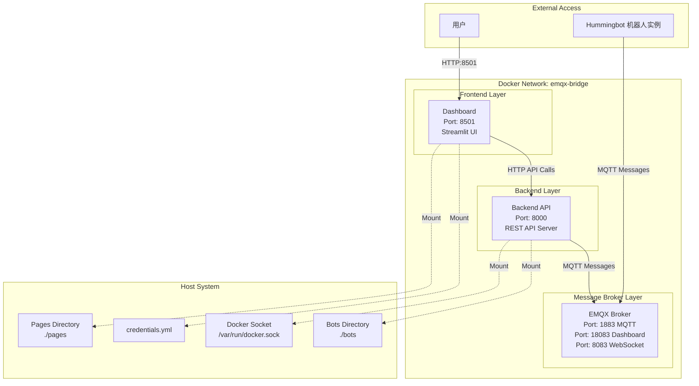

# Hummingbot 部署项目架构分析

## 项目概述

这是一个基于 **Hummingbot** 的量化交易管理系统，采用微服务架构设计，提供完整的交易策略配置、部署、监控和分析功能。

## 系统架构

### 架构图




### 三层架构设计

#### 1. 前端展示层 (Dashboard)
- **技术栈**: Streamlit 框架
- **端口**: 8501
- **功能**: 提供用户友好的 Web 图形界面
- **特点**: 
  - 交互式配置界面
  - 实时数据可视化
  - 多页面应用架构

#### 2. 业务逻辑层 (Backend API)
- **技术栈**: REST API 服务器
- **端口**: 8000
- **功能**: 
  - 处理业务逻辑
  - 数据管理
  - 机器人实例管理
  - Docker 容器操作

#### 3. 消息中间件层 (EMQX)
- **技术栈**: MQTT 消息代理
- **端口**: 
  - 1883 (MQTT)
  - 18083 (管理界面)
  - 8083 (WebSocket)
- **功能**: 
  - 实时消息传递
  - 机器人状态通信
  - 事件分发

## 服务依赖关系

### 依赖链路
```
dashboard → backend-api → emqx
```

### 通信协议
- **dashboard ↔ backend-api**: HTTP REST API
- **backend-api ↔ emqx**: MQTT 协议
- **bot instances ↔ emqx**: MQTT 协议

### 网络配置
- 所有服务运行在 `emqx-bridge` Docker 网络中
- 服务间通过容器名进行服务发现
- 支持水平扩展和负载均衡

## Frontend Pages 详细分析

### 目录结构
```
pages/
├── config/              # 策略配置页面
├── ai_agent/           # AI 助手页面 (需要权限)
├── orchestration/       # 机器人编排页面 (需要权限)
├── performance/         # 性能分析页面
├── data/               # 数据管理页面
└── permissions.py      # 权限管理
```

### 页面分类与功能

#### 1. 配置生成器页面 (`config/`)
**目的**: 通过可视化界面配置各种交易策略

- **PMM Simple/Dynamic** (`pmm_simple/`, `pmm_dynamic/`)
  - 做市商策略配置
  - 支持价差、数量、订单层级设置
  - 实时回测和性能预览

- **Grid Strike** (`grid_strike/`)
  - 网格交易策略
  - 价格区间和网格密度配置

- **技术指标策略**:
  - **Bollinger V1** (`bollinger_v1/`): 布林带策略
  - **MACD_BB V1** (`macd_bb_v1/`): MACD + 布林带组合策略
  - **SuperTrend V1** (`supertrend_v1/`): 超级趋势策略

- **高级策略**:
  - **D-Man Maker V2** (`dman_maker_v2/`): 动态做市策略
  - **XEMM Controller** (`xemm_controller/`): 跨交易所做市策略
  - **Kalman Filter V1** (`kalman_filter_v1/`): 卡尔曼滤波策略
  - **Position Builder** (`position_builder/`): 仓位构建策略

#### 2. 数据管理页面 (`data/`)
**目的**: 提供数据获取、分析和可视化工具

- **Download Candles** (`download_candles/`)
  - K线数据下载和管理
  - 支持多个交易所和交易对

- **Token Spreads** (`token_spreads/`)
  - 代币价差分析
  - 套利机会识别

- **TVL vs Market Cap** (`tvl_vs_mcap/`)
  - 流动性与市值关系分析
  - DeFi 项目评估工具

#### 3. AI 助手页面 (`ai_agent/`) - 需要权限
**目的**: 通过 AI 对话生成 Hummingbot 交易策略代码

- **AI Agent** (`ai_agent/`)
  - 智能对话界面
  - 自动策略代码生成
  - 参数可视化配置
  - 一键保存和部署功能

#### 4. 机器人编排页面 (`orchestration/`) - 需要权限
**目的**: 管理和控制交易机器人的生命周期

- **Instances** (`instances/`)
  - 查看运行中的机器人实例
  - 实时状态监控
  - 启动/停止控制

- **Deploy V2** (`launch_bot_v2/`)
  - 新机器人部署界面
  - 配置验证和部署流程

- **Credentials** (`credentials/`)
  - 交易所 API 凭证管理
  - 安全密钥配置

- **Portfolio** (`portfolio/`)
  - 投资组合总览
  - 资产分布和收益分析

#### 5. 性能分析页面 (`performance/`)
**目的**: 提供策略和机器人的性能分析

- **Bot Performance** (`bot_performance/`)
  - 策略回测结果
  - 收益率分析
  - 风险指标计算

### 权限管理系统

#### 公开页面 (无需认证)
- 所有配置生成器页面
- 数据分析页面
- 性能分析页面

#### 私有页面 (需要认证)
- AI 助手页面
- 机器人编排相关页面
- 凭证管理
- 实例控制

## 技术特点

### 1. 模块化设计
- 每个策略都有独立的配置页面
- 组件化的 UI 元素
- 可插拔的策略模块

### 2. 实时交互
- Streamlit 提供实时 UI 更新
- MQTT 支持实时消息传递
- WebSocket 连接用于实时数据

### 3. 可视化功能
- 策略回测图表
- 实时性能监控
- 数据分析可视化

### 4. 容器化部署
- Docker Compose 编排
- 服务隔离和扩展
- 统一的网络和存储管理

## 数据流

### 配置流程
1. 用户通过 Dashboard 配置策略
2. 配置数据通过 Backend API 验证和存储
3. 配置文件保存到 `bots/` 目录

### 部署流程
1. Backend API 接收部署请求
2. 通过 Docker Socket 创建新的机器人容器
3. 机器人连接到 EMQX 进行状态报告

### 监控流程
1. 机器人通过 MQTT 发送状态更新
2. Backend API 收集和处理状态数据
3. Dashboard 显示实时监控信息

## 扩展性

### 水平扩展
- 可以部署多个 Dashboard 实例
- Backend API 支持负载均衡
- EMQX 支持集群模式

### 功能扩展
- 新策略可以通过添加新的页面模块实现
- 插件化的数据源接入
- 自定义指标和分析工具

这个架构设计使得用户可以通过友好的 Web 界面来管理复杂的量化交易系统，无需直接操作命令行或配置文件，大大降低了使用门槛。 
